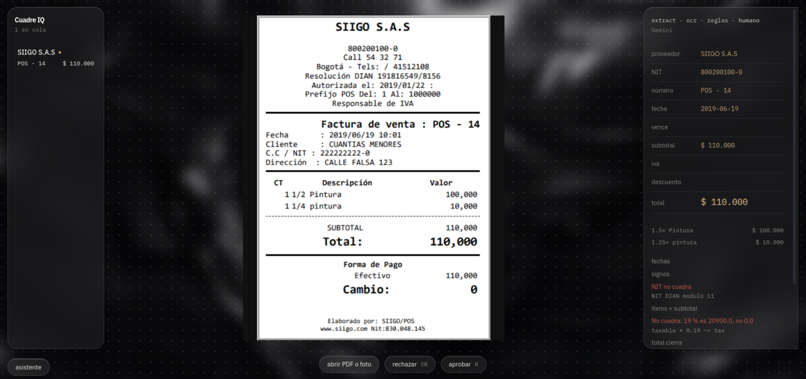
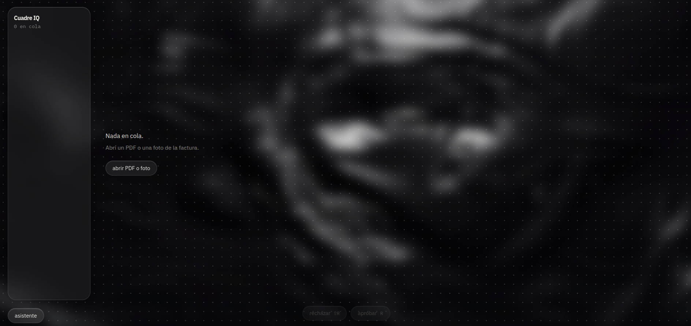
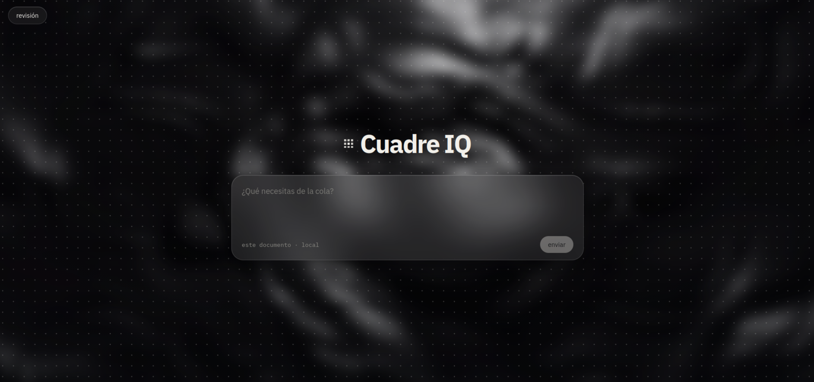

<HEAD
<p align="center">
  
</p>

<p align="center">
  extractor, validador y reconciliador de facturas<br/>
  <sub>local · python cuadra la plata · el operador confirma</sub>
</p>

<br/>

<p align="center">
  
</p>

<p align="center"><sub>cola · papel · inspector. amarillo = baja confianza. rojo = no cuadra.</sub></p>

<table>
  <tr>
    <td width="50%" valign="top">
      
      <sub>inbox o el botón. pdf y foto.</sub>
    </td>
    <td width="50%" valign="top">
      
      <sub>asistente local. sprint 2: n8n.</sub>
    </td>
  </tr>
</table>

---

pdf digital → pymupdf (0 tokens) · foto / scan → rapidocr · reglas → `validate.py` · humano confirma.

el watcher en `inbox/` mete lo que caiga. sqlite guarda el original. gemini queda apagado (`GEMINI_ENABLED=false`).

aprobar no recalcula. tecla `R` / `⇧R`.

### próximo sprint — n8n

el asistente no extrae. es el gancho del sprint 2: *manda esta factura a …* → el backend arma `{to, subject, path, document_id}` → n8n adjunta el original (gmail / smtp).

hoy el webhook está vacío: dry-run. imap de entrada y push a erp van en el mismo sprint.

### correr

```bash
ollama pull qwen3.5:0.8b
ollama pull nomic-embed-text

cd backend && python -m venv .venv && source .venv/bin/activate
pip install -r requirements.txt && cp .env.example .env

cd ../frontend && npm install
cd .. && npm install && npm run dev
```

http://127.0.0.1:5173 · api `:4005` · muestra `samples/norte.pdf`

vite 6 · react 19 · fastapi · ollama `qwen3.5:0.8b` · rapidocr · pymupdf

[`docs/API.md`](docs/API.md)
=======
